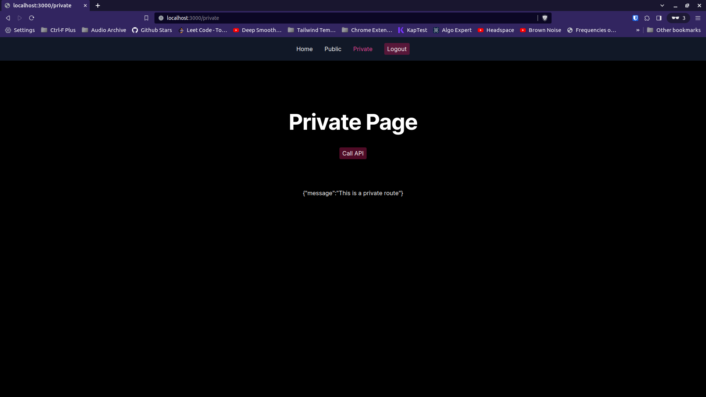

# Template: Next.js + Express.js + Auth0 + TypeScript + Tailwind
<!-- # Fullstack Node.js template using Next.js, Express.js, Auth0, Typescript, and Tailwind -->

<p align="center">
  
</p>

This repository provides a full-stack Node.js boilerplate for building web applications using a tech stack that includes Next.js, Express.js, Auth0, TypeScript, and Tailwind CSS.

This template is a companion to a detailed blog post that explains how to integrate Next.js with Express.js and Auth0 for authentication. Read the full guide [here](https://benjamin-chavez.com/blog/integrating-next.js-with-express.js-using-auth0-for-authentication).

<!--
## INTEGRATING NEXT.JS WITH EXPRESS.JS USING AUTH0 FOR AUTHENTICATION
A fullstack Node.js template that integrates a Next.js frontend with a stand alone Express.js Server and Auth0 authentication. This template is accompanied by blog post with details on how

to build this template application. -->


## Features

- [**Next.js**](https://nextjs.org/): For server-side rendered React applications.
- [**Express.js**](https://expressjs.com/): Backend server handling API requests and other server-side logic.
- [**Auth0**](https://auth0.com/): Secure and scalable authentication and authorization.
- [**TypeScript**](https://www.typescriptlang.org/): Static typing for JavaScript, enhancing development experience and maintainability.
- [**Tailwind CSS**](https://tailwindcss.com/): Utility-first CSS framework for rapid UI development.

## Getting Started

1. **Clone the Repository**

   ```bash
   git clone git@github.com:benjamin-chavez/nextjs-express-auth0-template.git
   ```

2. **Install Dependencies**

   ```bash
   pnpm install
   ```

3. **Setup Auth0**

   - Create an account on [Auth0](https://auth0.com/).
   - In Auth0, set up a Next.js Application and an Express API.
   - Update the `.env` files with your Auth0 credentials.

4. **Run the Development Server**

   ```bash
   pnpm run dev
   ```

   Open [http://localhost:3000](http://localhost:3000) with your browser to see the result.

## Deployment

- Build the application for production:

  ```bash
  pnpm run build
  ```

- Start the production server:

  ```bash
  pnpm start
  ```

<!-- ## Contributing

Contributions are welcome! Please read the [contributing guidelines](CONTRIBUTING.md) first. -->

## License

This project is licensed under the MIT License. See [LICENSE](LICENSE) for details.


<!-- //////////////////////////////// -->
<!-- Open [http://localhost:3000](http://localhost:3000) with your browser to see the result.
matcher: '/:path*',
Meanwhile, the pattern `matcher: '/:path*',` specifies which route requests should be processed by the middleware. In this case, all of our routes. -->
